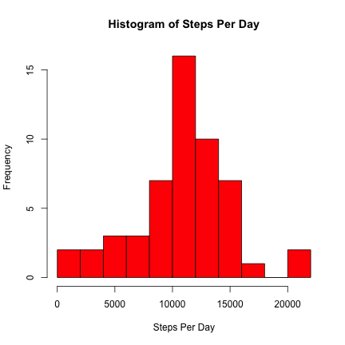
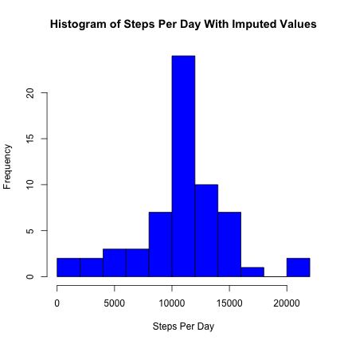
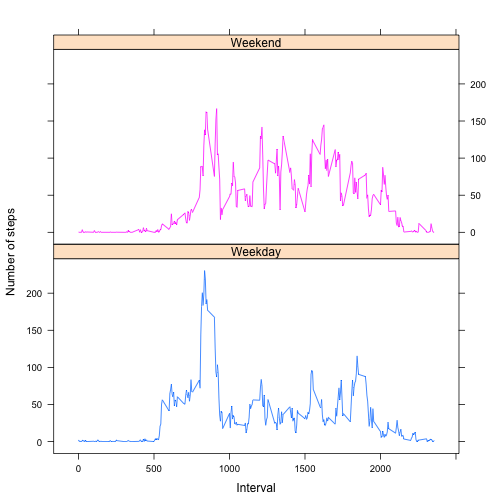

Reproducible Research - Peer Assessment 1
========================================================

### Loading and preprocessing the data

Prerequisites required to run analysis :

* Activity data downloaded from [the course web site](https://d396qusza40orc.cloudfront.net/repdata%2Fdata%2Factivity.zip), and unzip directly in working directory. 
* The working directory is set to where you want to run the analysis.
* The required packages are installed on your local system and dependencies loaded.

#### 1. Load the data 


```r
activity_ds <- read.csv("./activity.csv", sep=",", header=T, colClasses=c("numeric", "Date", "numeric"))
```

#### 2. Process/transform the data (if necessary) into a format suitable for your analysis

The steps and interval columns are coerced via colClasses into numeric format.

The date columns is coerced via colClasses into Date format.


```r
head(activity_ds)
```

```
##   steps       date interval
## 1    NA 2012-10-01        0
## 2    NA 2012-10-01        5
## 3    NA 2012-10-01       10
## 4    NA 2012-10-01       15
## 5    NA 2012-10-01       20
## 6    NA 2012-10-01       25
```

```r
summary(activity_ds)
```

```
##      steps            date               interval   
##  Min.   :  0.0   Min.   :2012-10-01   Min.   :   0  
##  1st Qu.:  0.0   1st Qu.:2012-10-16   1st Qu.: 589  
##  Median :  0.0   Median :2012-10-31   Median :1178  
##  Mean   : 37.4   Mean   :2012-10-31   Mean   :1178  
##  3rd Qu.: 12.0   3rd Qu.:2012-11-15   3rd Qu.:1766  
##  Max.   :806.0   Max.   :2012-11-30   Max.   :2355  
##  NA's   :2304
```

### What is mean total number of steps taken per day?

#### 1. Make a histogram of the total number of steps taken each day.


```r
# total number of steps per day
stepsPerDay <- aggregate(steps ~ date, data=activity_ds, FUN=sum)
```


```r
# histogram of the total steps taken (breaks=10 add clarity)
hist(stepsPerDay$steps, breaks =10, main="Histogram of Steps Per Day",
xlab="Steps Per Day", col="red")
```

 

#### 2. Calculate and report the **mean** and **median** total number of steps taken per day.


```r
meanStepsPerDay <- mean(stepsPerDay$steps)
medianStepsPerDay <- median(stepsPerDay$steps)
```
The mean total number of steps taken per day is **10766**.

The median total number of steps taken per day is **10765**.


### What is the average daily activity pattern?

#### 1. Make a time series plot (i.e. `type = "l"`) of the 5-minute interval (x-axis) and the average number of steps taken, averaged across all days (y-axis).


```r
# mean of steps per day by time interval
stepsInterval <- aggregate(steps~interval, data=activity_ds, FUN=mean)
```

```r
# time series plot of the 5-minute interval and average number of steps taken
plot(stepsInterval, type="l", main="Average Steps taken",
xlab="Time Intervals (5-minute)", ylab="Average Steps (all Days)")
```

 

#### 2. Which 5-minute interval, on average across all the days in the dataset, contains the maximum number of steps?


```r
maxInterval <- stepsInterval[which.max(stepsInterval$steps),"interval"]
```
The 5-minute interval, on average across all the days in the dataset, that contains the maximum number of steps is **835**.


### Imputing missing values

Note that there are a number of days/intervals where there are missing
values (coded as `NA`). The presence of missing days may introduce
bias into some calculations or summaries of the data.

#### 1. Calculate and report the total number of missing values in the dataset (i.e. the total number of rows with `NA`s) :

```r
missingValues <- sum(is.na(activity_ds))
```
The total number of missing values in the dataset is **2304**.

#### 2. Devise a strategy for filling in all of the missing values in the dataset. The strategy does not need to be sophisticated. For example, you could use the mean/median for that day, or the mean for that 5-minute interval, etc.


```r
meansteps <- tapply(activity_ds$steps, activity_ds$interval, mean, na.rm=TRUE)
index <- which(is.na(activity_ds))
imputed_ds <- meansteps[as.character(activity_ds[index, 3])]
names(imputed_ds) <- index
for (i in index) {
    # we update the main dataset with imputed values
    activity_ds$steps[i] = imputed_ds[as.character(i)]
}
```

#### 3. The original dataset have been updated with the missing data filled in.


```r
stepsPerDayClean <- aggregate(steps~date, data=activity_ds, FUN=sum)
```

#### 4. Make a histogram of the total number of steps taken each day and Calculate and report the **mean** and **median** total number of steps taken per day. Do these values differ from the estimates from the first part of the assignment? What is the impact of imputing missing data on the estimates of the total daily number of steps?


```r
# Histogram of the total number of steps taken each day
hist(stepsPerDayClean$steps, breaks=10,
main="Histogram of Steps Per Day With Imputed Values",
xlab="Steps Per Day", col="blue")
```

 

```r
# Calculate the mean and median total number of steps taken per day
meanStepsPerDayClean <- mean(stepsPerDayClean$steps)
medianStepsPerDayClean <- median(stepsPerDayClean$steps)
```
The mean total number of steps taken per day is **10766**.

The median total number of steps taken per day is **10766**

After imputing the missing step values, the impact of the imputation was a slight increase in the median total number of steps taken per day.

### Are there differences in activity patterns between weekdays and weekends?

For this part the `weekdays()` function may be of some help here. Use
the dataset with the filled-in missing values for this part.

#### 1. Create a new factor variable in the dataset with two levels -- "weekday" and "weekend" indicating whether a given date is a weekday or weekend day.


```r
library(lattice)
activity_ds$day<-as.factor(ifelse(weekdays(activity_ds$date) %in% c("Saturday","Sunday"),"Weekend","Weekday"))
# mean of steps per day by time interval
stepsIntervalDay <- aggregate(steps ~ interval + day, activity_ds, FUN = mean)
```

#### 2. Make a panel plot containing a time series plot (i.e. `type = "l"`) of the 5-minute interval (x-axis) and the average number of steps taken, averaged across all weekday days or weekend days (y-axis).


```r
xyplot(steps ~ interval | day, stepsIntervalDay, 
layout = c(1, 2), type = "l", group=day, 
xlab="Interval",ylab = "Number of steps")
```

 

Let's compute the mean, median, max and min of the steps across intervals and days by Weekdays/Weekends

```r
tapply(stepsIntervalDay$steps,stepsIntervalDay$day, function (x) { 
c(MINIMUM=min(x), MEAN=mean(x), MEDIAN=median(x), MAXIMUM=max(x))})
```

```
## $Weekday
## MINIMUM    MEAN  MEDIAN MAXIMUM 
##    0.00   35.61   25.80  230.38 
## 
## $Weekend
## MINIMUM    MEAN  MEDIAN MAXIMUM 
##    0.00   42.37   32.34  166.64
```

